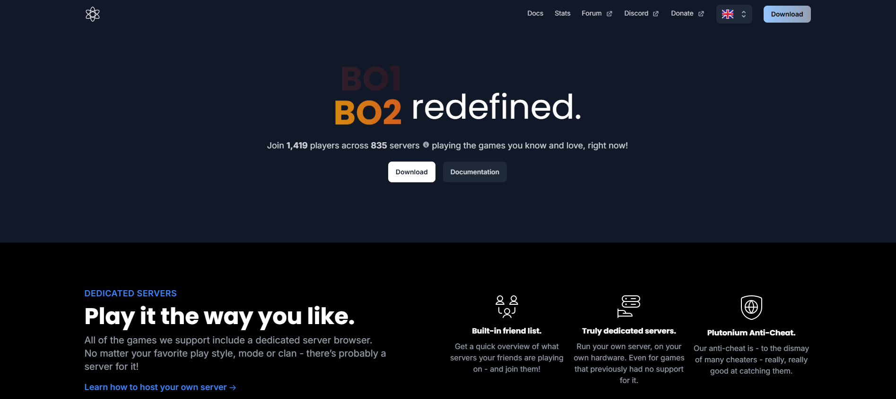

# Workshop 4

By: Davis Cordoba

## Emphasis 

Welcome to Plutonium! Plutonium offers a unique _Black Ops 2, Modern Warfare 3 & World at War experience_, complete with dedicated servers, mod support, and much much more. The entire modification is provided for free, we only ask that you enjoy your time playing and treat us with respect. Plutonium is a Project / Hobby that our staff team undertake in their spare time when not working or in education, we use it as a valuable tool to help us learn and gain experience in Reverse Engineering, Infrastructure, Architecture, Programming and a range of other Computer Science topics. _At our core we have a huge love_ for tinkering with our old beloved games and pushing them to new limits.


## Strong

**Plutonium** is made up of volunteer staff - including but not limited to; **Community Moderators, Quality Assurance, Developers (Web, Infrastructure, C++, ASM etc.) and Content Creators**. 


## Lists


### Unordered Lists

- List Item 1
- List Item 2
    - Sub Item 1
    - Sub Item 2
- List Item 3


### Order Lists

1. First Item
2. Second Item
    1. Sub Item 1
    2. Sub Item 2
3. Third Item


## Images



## Hyperlink

[Plutonium Website](https://plutonium.pw/)


## Including Code


### InLine

In HTML the `` tag is used to display pictures.

### Code Fences

```html
<nav>
    <p>
      <a href="./portfolio.html">My portfolio</a> is available on this site,
      too!
    </p>
  </nav>
```

```css
:root {
    font-family: sans-serif;
    background-color: #F2EFEA;
    color: black;
}

body {
    max-width: 90ch;
    margin: 0 auto;
    line-height: 1.5;
}

h1, h2, h3 {
    text-align: center;
    line-height: normal;
}
```
